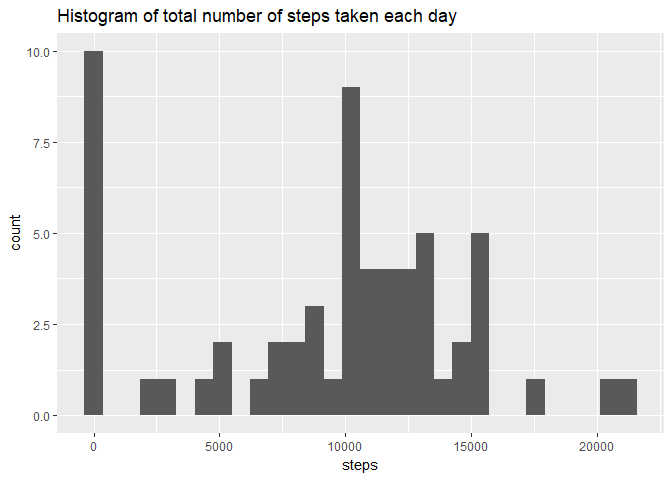
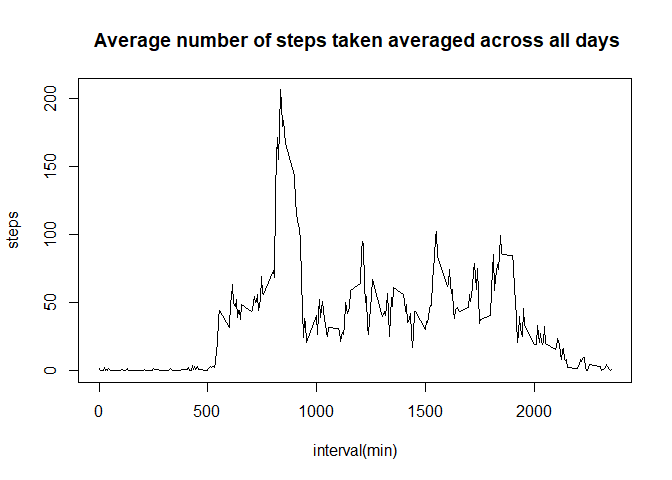
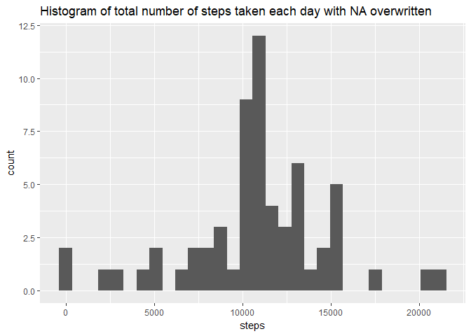
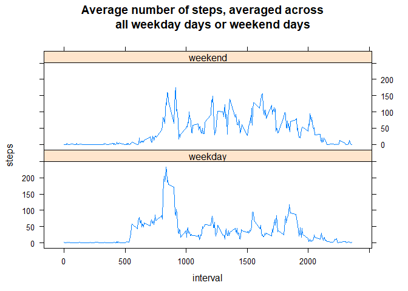

## Loading and preprocessing the data
1. Load the libraries

```r
library(knitr)
library(dplyr)
library(ggplot2)
library(lattice)
library(timeDate)
```

2. Load the data

```r
activity <- read.csv("activity.csv", stringsAsFactors = FALSE)
```


## What is mean total number of steps taken per day?
1. Calculate the total number of steps taken per day

```r
total_steps_per_day <- activity[,c(1,2)] %>% 
  group_by(date) %>%
  summarise(steps = sum(steps, na.rm = TRUE)) %>%
  as.data.frame()
head(total_steps_per_day)
```

```
##         date steps
## 1 2012-10-01     0
## 2 2012-10-02   126
## 3 2012-10-03 11352
## 4 2012-10-04 12116
## 5 2012-10-05 13294
## 6 2012-10-06 15420
```

2. Make a histogram of the total number of steps taken each day

```r
qplot(total_steps_per_day[,2], 
      geom = "histogram",
      main = "Histogram of total number of steps taken each day",
      xlab = "steps")
```

```
## `stat_bin()` using `bins = 30`. Pick better value with `binwidth`.
```

<!-- -->

3. Calculate and report the mean and median of the total number of steps taken per day

```r
mean(total_steps_per_day[,2])
```

```
## [1] 9354.23
```

```r
median(total_steps_per_day[,2])
```

```
## [1] 10395
```

## What is the average daily activity pattern?
1. Make a time series plot (i.e. type = "l") of the 5-minute interval (x-axis) and 
the average number of steps taken, averaged across all days 

```r
average_steps_a_day <- activity %>% 
  group_by(interval) %>%
  summarise(steps = mean(steps, na.rm = TRUE)) %>%
  as.data.frame()

plot(average_steps_a_day[,1],
     average_steps_a_day[,2],
     type = "l",
     main = " Average number of steps taken averaged across all days",
     xlab = "interval(min)",
     ylab = "steps")
```

<!-- -->

2. Which 5-minute interval, on average across all the days in the dataset, 
contains the maximum number of steps?

```r
average_steps_a_day[order(average_steps_a_day$steps, decreasing = TRUE),][1,1]
```

```
## [1] 835
```

## Imputing missing values
1. Calculate and report the total number of missing values in the dataset
(i.e. the total number of rows with NAs)

```r
sum(is.na(activity[,1]))
```

```
## [1] 2304
```

2. Devise a strategy for filling in all of the missing values in the dataset.
The strategy does not need to be sophisticated. For example, you could use 
the mean/median for that day, or the mean for that 5-minute interval, etc.

```r
temp <- activity
temp <- merge(temp, average_steps_a_day, by = "interval")
temp[is.na(temp[,2]),2] <- temp[is.na(temp[,2]),4]
head(temp)
```

```
##   interval  steps.x       date  steps.y
## 1        0 1.716981 2012-10-01 1.716981
## 2        0 0.000000 2012-11-23 1.716981
## 3        0 0.000000 2012-10-28 1.716981
## 4        0 0.000000 2012-11-06 1.716981
## 5        0 0.000000 2012-11-24 1.716981
## 6        0 0.000000 2012-11-15 1.716981
```

3. Create a new dataset that is equal to the original dataset
but with the missing data filled in.

```r
filled_activity <- temp[,c(2,3,1)]
colnames(filled_activity) <- c("steps", "date", "interval")
head(filled_activity)
```

```
##      steps       date interval
## 1 1.716981 2012-10-01        0
## 2 0.000000 2012-11-23        0
## 3 0.000000 2012-10-28        0
## 4 0.000000 2012-11-06        0
## 5 0.000000 2012-11-24        0
## 6 0.000000 2012-11-15        0
```

4. Make a histogram of the total number of steps taken each day and 
Calculate and report the mean and median total number of steps taken
per day. Do these values differ from the estimates from the first part 
of the assignment? What is the impact of imputing missing data on 
the estimates of the total daily number of steps?

```r
filled_total_steps_per_day <- filled_activity[,c(1,2)] %>% 
  group_by(date) %>%
  summarise(steps = sum(steps)) %>%
  as.data.frame()

qplot(total_steps_per_day[,2], 
      geom = "histogram",
      main = "Histogram of total number of steps taken each day",
      xlab = "steps")
```

```
## `stat_bin()` using `bins = 30`. Pick better value with `binwidth`.
```

<!-- -->

```r
qplot(filled_total_steps_per_day[,2], 
      geom = "histogram",
      main = "Histogram of total number of steps taken each day with NA overwritten",
      xlab = "steps")
```

```
## `stat_bin()` using `bins = 30`. Pick better value with `binwidth`.
```

<!-- -->

```r
mean(filled_total_steps_per_day[,2])
```

```
## [1] 10766.19
```

```r
median(filled_total_steps_per_day[,2])
```

```
## [1] 10766.19
```

## Are there differences in activity patterns between weekdays and weekends?
1.Create a new factor variable in the dataset with two levels "weekday" 
and "weekend" indicating whether a given date is a weekday or weekend day

```r
weekday_logical <- isWeekday(as.Date(activity[,2]))
weekday_activity <- mutate(activity, 
                           weekday = factor(weekday_logical, 
                                            levels = c(TRUE, FALSE), 
                                            labels = c("weekday", "weekend")))
head(weekday_activity)
```

```
##   steps       date interval weekday
## 1    NA 2012-10-01        0 weekday
## 2    NA 2012-10-01        5 weekday
## 3    NA 2012-10-01       10 weekday
## 4    NA 2012-10-01       15 weekday
## 5    NA 2012-10-01       20 weekday
## 6    NA 2012-10-01       25 weekday
```

2. Make a panel plot containing a time series plot (i.e. type = "l") of the 
5-minute interval (x-axis) and the average number of steps taken, averaged
across all weekday days or weekend days (y-axis). 

```r
weekday_average_steps_a_day <- weekday_activity %>% 
  group_by(interval, weekday) %>%
  summarise(steps = mean(steps, na.rm = TRUE)) %>%
  as.data.frame()

xyplot(steps~interval | weekday, 
       data = weekday_average_steps_a_day, 
       type = "l", 
       layout = c(1,2),
       main = "Average number of steps, averaged across 
       all weekday days or weekend days ")
```

<!-- -->
